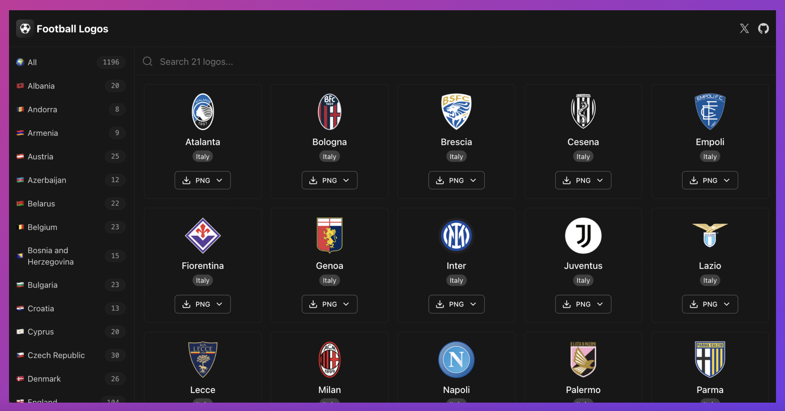

    <h1>✨⚽️ 1000+ Football Club Logos (PNG+SVG) ⚽️✨</h1>
    <a href="https://football-logos.cc">
        football-logos.cc
    </a>

## 🇦🇱 Albania

|Logo|Team|
|---|---|
||[Apolonia](https://football-logos.cc/albania/apolonia)|
||[Besa Peja](https://football-logos.cc/albania/besa-peja)|
||[Besa](https://football-logos.cc/albania/besa)|
||[Bylis](https://football-logos.cc/albania/bylis)|
||[Dinamo City](https://football-logos.cc/albania/dinamo-city)|
||[Egnatia](https://football-logos.cc/albania/egnatia)|
||[Flamurtari](https://football-logos.cc/albania/flamurtari)|
||[Kastrioti](https://football-logos.cc/albania/kastrioti)|
||[Kukës](https://football-logos.cc/albania/kukes)|
||[Laç](https://football-logos.cc/albania/lac)|
||[Lushnja](https://football-logos.cc/albania/lushnja)|
||[Partizani](https://football-logos.cc/albania/partizani)|
||[Pogradec](https://football-logos.cc/albania/pogradec)|
||[Shkumbini](https://football-logos.cc/albania/shkumbini)|
||[Skënderbeu](https://football-logos.cc/albania/skenderbeu)|
||[Tërbuni](https://football-logos.cc/albania/terbuni)|
||[Teuta](https://football-logos.cc/albania/teuta)|
||[Tirana](https://football-logos.cc/albania/tirana)|
||[Tomori](https://football-logos.cc/albania/tomori)|
||[Vllaznia](https://football-logos.cc/albania/vllaznia)|

## 🇦🇩 Andorra

|Logo|Team|
|---|---|
||[Atlètic Escaldes](https://football-logos.cc/andorra/atletic-escaldes)|
||[CE Carroi](https://football-logos.cc/andorra/ce-carroi)|
||[FC Santa Coloma](https://football-logos.cc/andorra/fc-santa-coloma)|
||[Inter Escaldes](https://football-logos.cc/andorra/inter-escaldes)|
||[Ordino](https://football-logos.cc/andorra/ordino)|
||[Penya Encarnada](https://football-logos.cc/andorra/penya-encarnada)|
||[Rànger's](https://football-logos.cc/andorra/ranger-s)|
||[UE Santa Coloma](https://football-logos.cc/andorra/ue-santa-coloma)|

## 🇦🇲 Armenia

|Logo|Team|
|---|---|
||[Alashkert](https://football-logos.cc/armenia/alashkert)|
||[Ararat-Armenia](https://football-logos.cc/armenia/ararat-armenia)|
||[Ararat](https://football-logos.cc/armenia/ararat)|
||[Gandzasar](https://football-logos.cc/armenia/gandzasar)|
||[Noah](https://football-logos.cc/armenia/noah)|
||[Pyunik](https://football-logos.cc/armenia/pyunik)|
||[Shirak](https://football-logos.cc/armenia/shirak)|
||[Urartu](https://football-logos.cc/armenia/urartu)|
||[Van](https://football-logos.cc/armenia/van)|

## 🇦🇹 Austria

|Logo|Team|
|---|---|
||[Admira](https://football-logos.cc/austria/admira)|
||[Altach](https://football-logos.cc/austria/altach)|
||[Amstetten](https://football-logos.cc/austria/amstetten)|
||[Austria Wien](https://football-logos.cc/austria/austria-wien)|
||[BW Linz](https://football-logos.cc/austria/bw-linz)|
||[First Vienna](https://football-logos.cc/austria/first-vienna)|
||[GAK](https://football-logos.cc/austria/gak)|
||[Hartberg](https://football-logos.cc/austria/hartberg)|
||[Horn](https://football-logos.cc/austria/horn)|
||[Kapfenberg](https://football-logos.cc/austria/kapfenberg)|
||[Klagenfurt](https://football-logos.cc/austria/klagenfurt)|
||[LASK](https://football-logos.cc/austria/lask)|
||[Lustenau](https://football-logos.cc/austria/lustenau)|
||[Neusiedl](https://football-logos.cc/austria/neusiedl)|
||[Ried](https://football-logos.cc/austria/ried)|
||[Salzburg](https://football-logos.cc/austria/salzburg)|
||[Schwaz](https://football-logos.cc/austria/schwaz)|
||[SK Rapid](https://football-logos.cc/austria/sk-rapid)|
||[St Pölten](https://football-logos.cc/austria/st-polten)|
||[Sturm Graz](https://football-logos.cc/austria/sturm-graz)|
||[Team für Wien](https://football-logos.cc/austria/team-fur-wien)|
||[Tirol](https://football-logos.cc/austria/tirol)|
||[Union Gurten](https://football-logos.cc/austria/union-gurten)|
||[Wiener Viktoria](https://football-logos.cc/austria/wiener-viktoria)|
||[Wolfsberg](https://football-logos.cc/austria/wolfsberg)|

## 🇦🇿 Azerbaijan

|Logo|Team|
|---|---|
||[Gabala](https://football-logos.cc/azerbaijan/gabala)|
||[Käpäz](https://football-logos.cc/azerbaijan/kapaz)|
||[Karvan](https://football-logos.cc/azerbaijan/karvan)|
||[Neftçi](https://football-logos.cc/azerbaijan/neftci)|
||[Qarabağ](https://football-logos.cc/azerbaijan/qarabag)|
||[Qaradag Lokbatan](https://football-logos.cc/azerbaijan/qaradag-lokbatan)|
||[Sabah](https://football-logos.cc/azerbaijan/sabah)|
||[Sabail](https://football-logos.cc/azerbaijan/sabail)|
||[Şamaxı](https://football-logos.cc/azerbaijan/samax)|
||[Sumqayıt](https://football-logos.cc/azerbaijan/sumqay-t)|
||[Turan](https://football-logos.cc/azerbaijan/turan)|
||[Zire](https://football-logos.cc/azerbaijan/zire)|

## 🇧🇾 Belarus

|Logo|Team|
|---|---|
||[Arsenal Dzerzhinsk](https://football-logos.cc/belarus/arsenal-dzerzhinsk)|
||[Baranovichi](https://football-logos.cc/belarus/baranovichi)|
||[BATE Borisov](https://football-logos.cc/belarus/bate-borisov)|
||[Dinamo Brest](https://football-logos.cc/belarus/dinamo-brest)|
||[Dinamo-Minsk](https://football-logos.cc/belarus/dinamo-minsk)|
||[Dnepr](https://football-logos.cc/belarus/dnepr)|
||[FC Torpedo](https://football-logos.cc/belarus/fc-torpedo)|
||[Gomel](https://football-logos.cc/belarus/gomel)|
||[Gomelzheldortrans](https://football-logos.cc/belarus/gomelzheldortrans)|
||[Isloch](https://football-logos.cc/belarus/isloch)|
||[Kommunalnik](https://football-logos.cc/belarus/kommunalnik)|
||[Lida](https://football-logos.cc/belarus/lida)|
||[Minsk](https://football-logos.cc/belarus/minsk)|
||[Naftan](https://football-logos.cc/belarus/naftan)|
||[Neman](https://football-logos.cc/belarus/neman)|
||[Shakhtyor](https://football-logos.cc/belarus/shakhtyor)|
||[Slavia-Mozyr](https://football-logos.cc/belarus/slavia-mozyr)|
||[Slutsk](https://football-logos.cc/belarus/slutsk)|
||[Smorgon](https://football-logos.cc/belarus/smorgon)|
||[Torpedo-SKA](https://football-logos.cc/belarus/torpedo-ska)|
||[Vitebsk](https://football-logos.cc/belarus/vitebsk)|
||[Zvezda](https://football-logos.cc/belarus/zvezda)|

## 🇧🇪 Belgium

|Logo|Team|
|---|---|
||[Anderlecht](https://football-logos.cc/belgium/anderlecht)|
||[Antwerp](https://football-logos.cc/belgium/antwerp)|
||[Beerschot Wilrijk](https://football-logos.cc/belgium/beerschot-wilrijk)|
||[Beveren](https://football-logos.cc/belgium/beveren)|
||[Cercle Brugge](https://football-logos.cc/belgium/cercle-brugge)|
||[Charleroi](https://football-logos.cc/belgium/charleroi)|
||[Club Brugge](https://football-logos.cc/belgium/club-brugge)|
||[Dessel](https://football-logos.cc/belgium/dessel)|
||[Eupen](https://football-logos.cc/belgium/eupen)|
||[Genk](https://football-logos.cc/belgium/genk)|
||[Gent](https://football-logos.cc/belgium/gent)|
||[Kortrijk](https://football-logos.cc/belgium/kortrijk)|
||[Leuven](https://football-logos.cc/belgium/leuven)|
||[Mechelen](https://football-logos.cc/belgium/mechelen)|
||[Oostende](https://football-logos.cc/belgium/oostende)|
||[Rupel Boom](https://football-logos.cc/belgium/rupel-boom)|
||[Seraing](https://football-logos.cc/belgium/seraing)|
||[Sint-Truiden](https://football-logos.cc/belgium/sint-truiden)|
||[Standard Liège](https://football-logos.cc/belgium/standard-liege)|
||[Union SG](https://football-logos.cc/belgium/union-sg)|
||[Waasland-Beveren](https://football-logos.cc/belgium/waasland-beveren)|
||[Westerlo](https://football-logos.cc/belgium/westerlo)|
||[Zulte Waregem](https://football-logos.cc/belgium/zulte-waregem)|

## 🇧🇦 Bosnia and Herzegovina

|Logo|Team|
|---|---|
||[Borac](https://football-logos.cc/bosnia-and-herzegovina/borac)|
||[Čelik](https://football-logos.cc/bosnia-and-herzegovina/celik)|
||[GOŠK](https://football-logos.cc/bosnia-and-herzegovina/gosk)|
||[Igman](https://football-logos.cc/bosnia-and-herzegovina/igman)|
||[Kozara](https://football-logos.cc/bosnia-and-herzegovina/kozara)|
||[Leotar](https://football-logos.cc/bosnia-and-herzegovina/leotar)|
||[Radnik Bijeljina](https://football-logos.cc/bosnia-and-herzegovina/radnik-bijeljina)|
||[Sarajevo](https://football-logos.cc/bosnia-and-herzegovina/sarajevo)|
||[Sloga](https://football-logos.cc/bosnia-and-herzegovina/sloga)|
||[Tuzla City](https://football-logos.cc/bosnia-and-herzegovina/tuzla-city)|
||[Velež](https://football-logos.cc/bosnia-and-herzegovina/velez)|
||[Željezničar](https://football-logos.cc/bosnia-and-herzegovina/zeljeznicar)|
||[Zrinjski](https://football-logos.cc/bosnia-and-herzegovina/zrinjski)|
||[Zvijezda 09](https://football-logos.cc/bosnia-and-herzegovina/zvijezda-09)|
||[Zvijezda](https://football-logos.cc/bosnia-and-herzegovina/zvijezda)|

## 🇧🇬 Bulgaria

|Logo|Team|
|---|---|
||[Arda](https://football-logos.cc/bulgaria/arda)|
||[Beroe](https://football-logos.cc/bulgaria/beroe)|
||[Botev Plovdiv](https://football-logos.cc/bulgaria/botev-plovdiv)|
||[Botev Vratsa](https://football-logos.cc/bulgaria/botev-vratsa)|
||[Cherno More](https://football-logos.cc/bulgaria/cherno-more)|
||[CSKA 1948](https://football-logos.cc/bulgaria/cska-1948)|
||[CSKA-Sofia](https://football-logos.cc/bulgaria/cska-sofia)|
||[Dunav](https://football-logos.cc/bulgaria/dunav)|
||[Etar](https://football-logos.cc/bulgaria/etar)|
||[Hebar](https://football-logos.cc/bulgaria/hebar)|
||[Levski](https://football-logos.cc/bulgaria/levski)|
||[Litex](https://football-logos.cc/bulgaria/litex)|
||[Lokomotiv Plovdiv](https://football-logos.cc/bulgaria/lokomotiv-plovdiv)|
||[Lokomotiv Sofia](https://football-logos.cc/bulgaria/lokomotiv-sofia)|
||[Ludogorets](https://football-logos.cc/bulgaria/ludogorets)|
||[Marek](https://football-logos.cc/bulgaria/marek)|
||[Montana](https://football-logos.cc/bulgaria/montana)|
||[Neftochimic](https://football-logos.cc/bulgaria/neftochimic)|
||[PFC Dobrudzha Dobrich](https://football-logos.cc/bulgaria/pfc-dobrudzha-dobrich)|
||[Pirin](https://football-logos.cc/bulgaria/pirin)|
||[Septemvri](https://football-logos.cc/bulgaria/septemvri)|
||[Slavia Sofia](https://football-logos.cc/bulgaria/slavia-sofia)|
||[Spartak Varna](https://football-logos.cc/bulgaria/spartak-varna)|

## 🇭🇷 Croatia

|Logo|Team|
|---|---|
||[GNK Dinamo](https://football-logos.cc/croatia/gnk-dinamo)|
||[Gorica](https://football-logos.cc/croatia/gorica)|
||[Hajduk Split](https://football-logos.cc/croatia/hajduk-split)|
||[Istra 1961](https://football-logos.cc/croatia/istra-1961)|
||[Lokomotiva Zagreb](https://football-logos.cc/croatia/lokomotiva-zagreb)|
||[NK Zagora](https://football-logos.cc/croatia/nk-zagora)|
||[Osijek](https://football-logos.cc/croatia/osijek)|
||[Rijeka](https://football-logos.cc/croatia/rijeka)|
||[Rudeš](https://football-logos.cc/croatia/rudes)|
||[Šibenik](https://football-logos.cc/croatia/sibenik)|
||[Slaven](https://football-logos.cc/croatia/slaven)|
||[Slavonija Pozega](https://football-logos.cc/croatia/slavonija-pozega)|
||[Varaždin](https://football-logos.cc/croatia/varazdin)|

## 🇨🇾 Cyprus

|Logo|Team|
|---|---|
||[AEK Larnaca](https://football-logos.cc/cyprus/aek-larnaca)|
||[AEL](https://football-logos.cc/cyprus/ael)|
||[AEZ](https://football-logos.cc/cyprus/aez)|
||[Akritas Chlorakas](https://football-logos.cc/cyprus/akritas-chlorakas)|
||[Anagennisis](https://football-logos.cc/cyprus/anagennisis)|
||[Anorthosis](https://football-logos.cc/cyprus/anorthosis)|
||[APOEL](https://football-logos.cc/cyprus/apoel)|
||[Apollon](https://football-logos.cc/cyprus/apollon)|
||[Aris Limassol](https://football-logos.cc/cyprus/aris-limassol)|
||[Ayia Napa](https://football-logos.cc/cyprus/ayia-napa)|
||[Doxa](https://football-logos.cc/cyprus/doxa)|
||[Ethnikos Achnas](https://football-logos.cc/cyprus/ethnikos-achnas)|
||[Karmiotissa](https://football-logos.cc/cyprus/karmiotissa)|
||[Nea Salamis](https://football-logos.cc/cyprus/nea-salamis)|
||[Olympiakos](https://football-logos.cc/cyprus/olympiakos)|
||[Omonia Aradippou](https://football-logos.cc/cyprus/omonia-aradippou)|
||[Omonoia](https://football-logos.cc/cyprus/omonoia)|
||[Othellos](https://football-logos.cc/cyprus/othellos)|
||[Pafos](https://football-logos.cc/cyprus/pafos)|
||[Paralimni](https://football-logos.cc/cyprus/paralimni)|

## 🇨🇿 Czech Republic

|Logo|Team|
|---|---|
||[Baník](https://football-logos.cc/czech-republic/banik)|
||[Bohemians Praha](https://football-logos.cc/czech-republic/bohemians-praha)|
||[Brno](https://football-logos.cc/czech-republic/brno)|
||[České Budějovice](https://football-logos.cc/czech-republic/ceske-budejovice)|
||[Chrudim](https://football-logos.cc/czech-republic/chrudim)|
||[Dukla](https://football-logos.cc/czech-republic/dukla)|
||[Fotbal Třinec](https://football-logos.cc/czech-republic/fotbal-trinec)|
||[Hradec Králové](https://football-logos.cc/czech-republic/hradec-kralove)|
||[Jablonec](https://football-logos.cc/czech-republic/jablonec)|
||[Jihlava](https://football-logos.cc/czech-republic/jihlava)|
||[Jiskra Domazlice](https://football-logos.cc/czech-republic/jiskra-domazlice)|
||[Karviná](https://football-logos.cc/czech-republic/karvina)|
||[Liberec](https://football-logos.cc/czech-republic/liberec)|
||[Mladá Boleslav](https://football-logos.cc/czech-republic/mlada-boleslav)|
||[Olomouc](https://football-logos.cc/czech-republic/olomouc)|
||[Opava](https://football-logos.cc/czech-republic/opava)|
||[Pardubice](https://football-logos.cc/czech-republic/pardubice)|
||[Písek](https://football-logos.cc/czech-republic/pisek)|
||[Příbram](https://football-logos.cc/czech-republic/pribram)|
||[Prostejov](https://football-logos.cc/czech-republic/prostejov)|
||[Rosice](https://football-logos.cc/czech-republic/rosice)|
||[Slavia Praha](https://football-logos.cc/czech-republic/slavia-praha)|
||[Slovácko](https://football-logos.cc/czech-republic/slovacko)|
||[Slovan Varnsdorf](https://football-logos.cc/czech-republic/slovan-varnsdorf)|
||[Sparta Praha](https://football-logos.cc/czech-republic/sparta-praha)|
||[Teplice](https://football-logos.cc/czech-republic/teplice)|
||[Unicov](https://football-logos.cc/czech-republic/unicov)|
||[Viktoria Plzeň](https://football-logos.cc/czech-republic/viktoria-plzen)|
||[Žižkov](https://football-logos.cc/czech-republic/zizkov)|
||[Zlín](https://football-logos.cc/czech-republic/zlin)|

## 🇩🇰 Denmark

|Logo|Team|
|---|---|
||[AaB](https://football-logos.cc/denmark/aab)|
||[AB](https://football-logos.cc/denmark/ab)|
||[AGF](https://football-logos.cc/denmark/agf)|
||[B 1908](https://football-logos.cc/denmark/b-1908)|
||[B 1913](https://football-logos.cc/denmark/b-1913)|
||[Brøndby](https://football-logos.cc/denmark/br-ndby)|
||[Brønshøj](https://football-logos.cc/denmark/br-nsh-j)|
||[Copenhagen](https://football-logos.cc/denmark/copenhagen)|
||[Esbjerg](https://football-logos.cc/denmark/esbjerg)|
||[Fredericia](https://football-logos.cc/denmark/fredericia)|
||[Frem](https://football-logos.cc/denmark/frem)|
||[Horsens](https://football-logos.cc/denmark/horsens)|
||[Hvidovre IF](https://football-logos.cc/denmark/hvidovre-if)|
||[Køge](https://football-logos.cc/denmark/k-ge)|
||[Lyngby](https://football-logos.cc/denmark/lyngby)|
||[Midtjylland](https://football-logos.cc/denmark/midtjylland)|
||[Næstved](https://football-logos.cc/denmark/n-stved)|
||[Nordsjælland](https://football-logos.cc/denmark/nordsj-lland)|
||[OB](https://football-logos.cc/denmark/ob)|
||[Randers](https://football-logos.cc/denmark/randers)|
||[SønderjyskE](https://football-logos.cc/denmark/s-nderjyske)|
||[Silkeborg](https://football-logos.cc/denmark/silkeborg)|
||[Skive](https://football-logos.cc/denmark/skive)|
||[VB](https://football-logos.cc/denmark/vb)|
||[Vendsyssel](https://football-logos.cc/denmark/vendsyssel)|
||[Viborg](https://football-logos.cc/denmark/viborg)|

## 🏴󠁧󠁢󠁥󠁮󠁧󠁿 England

|Logo|Team|
|---|---|
||[Accrington](https://football-logos.cc/england/accrington)|
||[AFC Fylde](https://football-logos.cc/england/afc-fylde)|
||[Arsenal](https://football-logos.cc/england/arsenal)|
||[Aston Villa](https://football-logos.cc/england/aston-villa)|
||[Barnet](https://football-logos.cc/england/barnet)|
||[Barnsley](https://football-logos.cc/england/barnsley)|
||[Barwell](https://football-logos.cc/england/barwell)|
||[Birmingham](https://football-logos.cc/england/birmingham)|
||[Blackburn](https://football-logos.cc/england/blackburn)|
||[Blackpool](https://football-logos.cc/england/blackpool)|
||[Bolton](https://football-logos.cc/england/bolton)|
||[Bournemouth](https://football-logos.cc/england/bournemouth)|
||[Bradford](https://football-logos.cc/england/bradford)|
||[Brentford](https://football-logos.cc/england/brentford)|
||[Brighton](https://football-logos.cc/england/brighton)|
||[Bristol City](https://football-logos.cc/england/bristol-city)|
||[Bristol Rovers](https://football-logos.cc/england/bristol-rovers)|
||[Burnley](https://football-logos.cc/england/burnley)|
||[Burton](https://football-logos.cc/england/burton)|
||[Bury](https://football-logos.cc/england/bury)|
||[Cardiff](https://football-logos.cc/england/cardiff)|
||[Carlisle](https://football-logos.cc/england/carlisle)|
||[Charlton](https://football-logos.cc/england/charlton)|
||[Chelsea](https://football-logos.cc/england/chelsea)|
||[Cheltenham](https://football-logos.cc/england/cheltenham)|
||[Chesham](https://football-logos.cc/england/chesham)|
||[Colchester](https://football-logos.cc/england/colchester)|
||[Coventry](https://football-logos.cc/england/coventry)|
||[Crewe](https://football-logos.cc/england/crewe)|
||[Crystal Palace](https://football-logos.cc/england/crystal-palace)|
||[Derby](https://football-logos.cc/england/derby)|
||[Didcot Town](https://football-logos.cc/england/didcot-town)|
||[Dover Athletic](https://football-logos.cc/england/dover-athletic)|
||[Eastleigh](https://football-logos.cc/england/eastleigh)|
||[Everton](https://football-logos.cc/england/everton)|
||[Exeter](https://football-logos.cc/england/exeter)|
||[Fulham](https://football-logos.cc/england/fulham)|
||[Gainsborough Trinity](https://football-logos.cc/england/gainsborough-trinity)|
||[Gillingham](https://football-logos.cc/england/gillingham)|
||[Grimsby](https://football-logos.cc/england/grimsby)|
||[Győr](https://football-logos.cc/england/gyor)|
||[Hartlepool](https://football-logos.cc/england/hartlepool)|
||[Huddersfield](https://football-logos.cc/england/huddersfield)|
||[Hull](https://football-logos.cc/england/hull)|
||[Ipswich](https://football-logos.cc/england/ipswich)|
||[Leeds](https://football-logos.cc/england/leeds)|
||[Leicester](https://football-logos.cc/england/leicester)|
||[Leyton Orient](https://football-logos.cc/england/leyton-orient)|
||[Lincoln City](https://football-logos.cc/england/lincoln-city)|
||[Liverpool](https://football-logos.cc/england/liverpool)|
||[Luton](https://football-logos.cc/england/luton)|
||[Maidenhead](https://football-logos.cc/england/maidenhead)|
||[Maidstone](https://football-logos.cc/england/maidstone)|
||[Manchester City](https://football-logos.cc/england/manchester-city)|
||[Manchester United](https://football-logos.cc/england/manchester-united)|
||[Mansfield](https://football-logos.cc/england/mansfield)|
||[Middlesbrough](https://football-logos.cc/england/middlesbrough)|
||[Millwall](https://football-logos.cc/england/millwall)|
||[MK Dons](https://football-logos.cc/england/mk-dons)|
||[Morecambe](https://football-logos.cc/england/morecambe)|
||[Newcastle](https://football-logos.cc/england/newcastle)|
||[Newport](https://football-logos.cc/england/newport)|
||[Northampton](https://football-logos.cc/england/northampton)|
||[Northwich Victoria](https://football-logos.cc/england/northwich-victoria)|
||[Norwich](https://football-logos.cc/england/norwich)|
||[Nottm Forest](https://football-logos.cc/england/nottm-forest)|
||[Notts County](https://football-logos.cc/england/notts-county)|
||[Oldham](https://football-logos.cc/england/oldham)|
||[Oxford](https://football-logos.cc/england/oxford)|
||[Peterborough](https://football-logos.cc/england/peterborough)|
||[Plymouth](https://football-logos.cc/england/plymouth)|
||[Port Vale](https://football-logos.cc/england/port-vale)|
||[Portsmouth](https://football-logos.cc/england/portsmouth)|
||[Preston](https://football-logos.cc/england/preston)|
||[QPR](https://football-logos.cc/england/qpr)|
||[Reading](https://football-logos.cc/england/reading)|
||[Rochdale](https://football-logos.cc/england/rochdale)|
||[Rotherham](https://football-logos.cc/england/rotherham)|
||[Salford City](https://football-logos.cc/england/salford-city)|
||[Scunthorpe](https://football-logos.cc/england/scunthorpe)|
||[Sheff. Wednesday](https://football-logos.cc/england/sheff-wednesday)|
||[Shrewsbury](https://football-logos.cc/england/shrewsbury)|
||[Southampton](https://football-logos.cc/england/southampton)|
||[Southend](https://football-logos.cc/england/southend)|
||[Stevenage](https://football-logos.cc/england/stevenage)|
||[Stoke](https://football-logos.cc/england/stoke)|
||[Sunderland](https://football-logos.cc/england/sunderland)|
||[Swansea](https://football-logos.cc/england/swansea)|
||[Torquay United](https://football-logos.cc/england/torquay-united)|
||[Tottenham](https://football-logos.cc/england/tottenham)|
||[Tranmere](https://football-logos.cc/england/tranmere)|
||[United of Manchester](https://football-logos.cc/england/united-of-manchester)|
||[Walsall](https://football-logos.cc/england/walsall)|
||[Watford](https://football-logos.cc/england/watford)|
||[Wealdstone](https://football-logos.cc/england/wealdstone)|
||[West Brom](https://football-logos.cc/england/west-brom)|
||[West Ham](https://football-logos.cc/england/west-ham)|
||[Whitehawk](https://football-logos.cc/england/whitehawk)|
||[Wigan](https://football-logos.cc/england/wigan)|
||[Wolves](https://football-logos.cc/england/wolves)|
||[Wrexham](https://football-logos.cc/england/wrexham)|
||[Wycombe](https://football-logos.cc/england/wycombe)|
||[Yeovil](https://football-logos.cc/england/yeovil)|
||[York](https://football-logos.cc/england/york)|

## 🇪🇪 Estonia

|Logo|Team|
|---|---|
||[Flora Tallinn](https://football-logos.cc/estonia/flora-tallinn)|
||[Kalev](https://football-logos.cc/estonia/kalev)|
||[Kalju](https://football-logos.cc/estonia/kalju)|
||[Kuressaare](https://football-logos.cc/estonia/kuressaare)|
||[Legion](https://football-logos.cc/estonia/legion)|
||[Levadia](https://football-logos.cc/estonia/levadia)|
||[Paide](https://football-logos.cc/estonia/paide)|
||[Tammeka](https://football-logos.cc/estonia/tammeka)|
||[Trans](https://football-logos.cc/estonia/trans)|
||[Tulevik](https://football-logos.cc/estonia/tulevik)|

## 🇫🇴 Faroe Islands

|Logo|Team|
|---|---|
||[07 Vestur](https://football-logos.cc/faroe-islands/07-vestur)|
||[AB](https://football-logos.cc/faroe-islands/ab)|
||[B36 Tórshavn](https://football-logos.cc/faroe-islands/b36-torshavn)|
||[B68](https://football-logos.cc/faroe-islands/b68)|
||[B71](https://football-logos.cc/faroe-islands/b71)|
||[EB/Streymur](https://football-logos.cc/faroe-islands/eb-streymur)|
||[HB](https://football-logos.cc/faroe-islands/hb)|
||[ÍF](https://football-logos.cc/faroe-islands/if)|
||[Klaksvík](https://football-logos.cc/faroe-islands/klaksvik)|
||[NSÍ](https://football-logos.cc/faroe-islands/nsi)|
||[Skála](https://football-logos.cc/faroe-islands/skala)|
||[Suduroy](https://football-logos.cc/faroe-islands/suduroy)|
||[TB](https://football-logos.cc/faroe-islands/tb)|
||[Víkingur](https://football-logos.cc/faroe-islands/vikingur)|

## 🇫🇮 Finland

|Logo|Team|
|---|---|
||[Haka](https://football-logos.cc/finland/haka)|
||[HJK](https://football-logos.cc/finland/hjk)|
||[Honka](https://football-logos.cc/finland/honka)|
||[Ilves](https://football-logos.cc/finland/ilves)|
||[Inter Turku](https://football-logos.cc/finland/inter-turku)|
||[Jazz](https://football-logos.cc/finland/jazz)|
||[JJK](https://football-logos.cc/finland/jjk)|
||[KPV](https://football-logos.cc/finland/kpv)|
||[KTP](https://football-logos.cc/finland/ktp)|
||[KuPS](https://football-logos.cc/finland/kups)|
||[Lahti](https://football-logos.cc/finland/lahti)|
||[Mariehamn](https://football-logos.cc/finland/mariehamn)|
||[MP](https://football-logos.cc/finland/mp)|
||[MYPA](https://football-logos.cc/finland/mypa)|
||[Oulu](https://football-logos.cc/finland/oulu)|
||[SJK](https://football-logos.cc/finland/sjk)|
||[Tampere United](https://football-logos.cc/finland/tampere-united)|
||[TPS](https://football-logos.cc/finland/tps)|
||[TPV](https://football-logos.cc/finland/tpv)|
||[VPS](https://football-logos.cc/finland/vps)|

## 🇫🇷 France

|Logo|Team|
|---|---|
||[Angers](https://football-logos.cc/france/angers)|
||[Auxerre](https://football-logos.cc/france/auxerre)|
||[Brest](https://football-logos.cc/france/brest)|
||[Le Havre](https://football-logos.cc/france/le-havre)|
||[Lens](https://football-logos.cc/france/lens)|
||[Lille](https://football-logos.cc/france/lille)|
||[Lyon](https://football-logos.cc/france/lyon)|
||[Marseille](https://football-logos.cc/france/marseille)|
||[Monaco](https://football-logos.cc/france/monaco)|
||[Montpellier](https://football-logos.cc/france/montpellier)|
||[Nantes](https://football-logos.cc/france/nantes)|
||[Nice](https://football-logos.cc/france/nice)|
||[Paris](https://football-logos.cc/france/paris)|
||[Reims](https://football-logos.cc/france/reims)|
||[Rennes](https://football-logos.cc/france/rennes)|
||[St-Étienne](https://football-logos.cc/france/st-etienne)|
||[Strasbourg](https://football-logos.cc/france/strasbourg)|
||[Toulouse](https://football-logos.cc/france/toulouse)|

## 🇬🇪 Georgia

|Logo|Team|
|---|---|
||[Chikhura](https://football-logos.cc/georgia/chikhura)|
||[Dila](https://football-logos.cc/georgia/dila)|
||[Dinamo Batumi](https://football-logos.cc/georgia/dinamo-batumi)|
||[Dinamo Tbilisi](https://football-logos.cc/georgia/dinamo-tbilisi)|
||[Gagra](https://football-logos.cc/georgia/gagra)|
||[Iberia](https://football-logos.cc/georgia/iberia)|
||[Kolkheti](https://football-logos.cc/georgia/kolkheti)|
||[Locomotive Tbilisi](https://football-logos.cc/georgia/locomotive-tbilisi)|
||[Merani](https://football-logos.cc/georgia/merani)|
||[Norchi Dinamoeli](https://football-logos.cc/georgia/norchi-dinamoeli)|
||[Samtredia](https://football-logos.cc/georgia/samtredia)|
||[Sioni](https://football-logos.cc/georgia/sioni)|
||[Telavi](https://football-logos.cc/georgia/telavi)|
||[Torpedo Kutaisi](https://football-logos.cc/georgia/torpedo-kutaisi)|
||[WIT Georgia](https://football-logos.cc/georgia/wit-georgia)|
||[Zestafoni](https://football-logos.cc/georgia/zestafoni)|

## 🇩🇪 Germany

|Logo|Team|
|---|---|
||[Aachen](https://football-logos.cc/germany/aachen)|
||[Arminia](https://football-logos.cc/germany/arminia)|
||[Augsburg](https://football-logos.cc/germany/augsburg)|
||[B. Dortmund](https://football-logos.cc/germany/b-dortmund)|
||[Bayern München](https://football-logos.cc/germany/bayern-munchen)|
||[Bochum](https://football-logos.cc/germany/bochum)|
||[Braunschweig](https://football-logos.cc/germany/braunschweig)|
||[Bremen](https://football-logos.cc/germany/bremen)|
||[Darmstadt](https://football-logos.cc/germany/darmstadt)|
||[Dresden](https://football-logos.cc/germany/dresden)|
||[Düsseldorf](https://football-logos.cc/germany/dusseldorf)|
||[Energie](https://football-logos.cc/germany/energie)|
||[Erzgebirge](https://football-logos.cc/germany/erzgebirge)|
||[Essen](https://football-logos.cc/germany/essen)|
||[FC Viktoria 1889 Berlin](https://football-logos.cc/germany/fc-viktoria-1889-berlin)|
||[Frankfurt](https://football-logos.cc/germany/frankfurt)|
||[Freiburg](https://football-logos.cc/germany/freiburg)|
||[Fürth](https://football-logos.cc/germany/furth)|
||[Hallescher](https://football-logos.cc/germany/hallescher)|
||[Hamburg](https://football-logos.cc/germany/hamburg)|
||[Hannover](https://football-logos.cc/germany/hannover)|
||[Hansa](https://football-logos.cc/germany/hansa)|
||[Heidenheim](https://football-logos.cc/germany/heidenheim)|
||[Hertha](https://football-logos.cc/germany/hertha)|
||[Hoffenheim](https://football-logos.cc/germany/hoffenheim)|
||[Ingolstadt](https://football-logos.cc/germany/ingolstadt)|
||[Jahn](https://football-logos.cc/germany/jahn)|
||[Jena](https://football-logos.cc/germany/jena)|
||[Kaiserslautern](https://football-logos.cc/germany/kaiserslautern)|
||[Karlsruhe](https://football-logos.cc/germany/karlsruhe)|
||[Kiel](https://football-logos.cc/germany/kiel)|
||[Köln](https://football-logos.cc/germany/koln)|
||[Leipzig](https://football-logos.cc/germany/leipzig)|
||[Leverkusen](https://football-logos.cc/germany/leverkusen)|
||[Magdeburg](https://football-logos.cc/germany/magdeburg)|
||[Mainz](https://football-logos.cc/germany/mainz)|
||[Mönchengladbach](https://football-logos.cc/germany/monchengladbach)|
||[Nürnberg](https://football-logos.cc/germany/nurnberg)|
||[Osnabrück](https://football-logos.cc/germany/osnabruck)|
||[Paderborn](https://football-logos.cc/germany/paderborn)|
||[Saarbrücken](https://football-logos.cc/germany/saarbrucken)|
||[Sandhausen](https://football-logos.cc/germany/sandhausen)|
||[Schalke](https://football-logos.cc/germany/schalke)|
||[St Pauli](https://football-logos.cc/germany/st-pauli)|
||[Stuttgart](https://football-logos.cc/germany/stuttgart)|
||[Union Berlin](https://football-logos.cc/germany/union-berlin)|
||[Wiesbaden](https://football-logos.cc/germany/wiesbaden)|
||[Wolfsburg](https://football-logos.cc/germany/wolfsburg)|
||[Würzburger Kickers](https://football-logos.cc/germany/wurzburger-kickers)|

## 🇬🇮 Gibraltar

|Logo|Team|
|---|---|
||[College](https://football-logos.cc/gibraltar/college)|
||[Europa Point](https://football-logos.cc/gibraltar/europa-point)|
||[Europa](https://football-logos.cc/gibraltar/europa)|
||[Glacis](https://football-logos.cc/gibraltar/glacis)|
||[Hound Dogs FC](https://football-logos.cc/gibraltar/hound-dogs-fc)|
||[L. Red Imps](https://football-logos.cc/gibraltar/l-red-imps)|
||[Lions Gibraltar](https://football-logos.cc/gibraltar/lions-gibraltar)|
||[Lynx](https://football-logos.cc/gibraltar/lynx)|
||[Magpies](https://football-logos.cc/gibraltar/magpies)|
||[Manchester 62](https://football-logos.cc/gibraltar/manchester-62)|
||[Mons Calpe](https://football-logos.cc/gibraltar/mons-calpe)|
||[St Joseph's](https://football-logos.cc/gibraltar/st-joseph-s)|

## 🇬🇷 Greece

|Logo|Team|
|---|---|
||[AEK Athens](https://football-logos.cc/greece/aek-athens)|
||[Aris Thessaloniki ](https://football-logos.cc/greece/aris-thessaloniki)|
||[Asteras](https://football-logos.cc/greece/asteras)|
||[Atromitos](https://football-logos.cc/greece/atromitos)|
||[Egaleo](https://football-logos.cc/greece/egaleo)|
||[Giannina](https://football-logos.cc/greece/giannina)|
||[Ionikos](https://football-logos.cc/greece/ionikos)|
||[Kavala](https://football-logos.cc/greece/kavala)|
||[Larissa](https://football-logos.cc/greece/larissa)|
||[OFI](https://football-logos.cc/greece/ofi)|
||[Olympiacos Volou](https://football-logos.cc/greece/olympiacos-volou)|
||[Olympiacos](https://football-logos.cc/greece/olympiacos)|
||[Panahaiki](https://football-logos.cc/greece/panahaiki)|
||[Panathinaikos](https://football-logos.cc/greece/panathinaikos)|
||[Panetolikos](https://football-logos.cc/greece/panetolikos)|
||[Panionios](https://football-logos.cc/greece/panionios)|
||[PAOK](https://football-logos.cc/greece/paok)|
||[Volos](https://football-logos.cc/greece/volos)|

## 🇭🇺 Hungary

|Logo|Team|
|---|---|
||[Ajka FC](https://football-logos.cc/hungary/ajka-fc)|
||[Békéscsaba](https://football-logos.cc/hungary/bekescsaba)|
||[Budafoki](https://football-logos.cc/hungary/budafoki)|
||[Budaors](https://football-logos.cc/hungary/budaors)|
||[Debrecen](https://football-logos.cc/hungary/debrecen)|
||[Diósgyőr](https://football-logos.cc/hungary/diosgyor)|
||[Dorogi FC](https://football-logos.cc/hungary/dorogi-fc)|
||[Eger](https://football-logos.cc/hungary/eger)|
||[Elore](https://football-logos.cc/hungary/elore)|
||[Fehérvár](https://football-logos.cc/hungary/fehervar)|
||[Ferencváros](https://football-logos.cc/hungary/ferencvaros)|
||[Gyirmót](https://football-logos.cc/hungary/gyirmot)|
||[Győr](https://football-logos.cc/hungary/gyor)|
||[Haladás](https://football-logos.cc/hungary/haladas)|
||[Honvéd](https://football-logos.cc/hungary/honved)|
||[Kazincbarcikai](https://football-logos.cc/hungary/kazincbarcikai)|
||[Kecskemét](https://football-logos.cc/hungary/kecskemet)|
||[Kisvárda](https://football-logos.cc/hungary/kisvarda)|
||[Mezőkövesd](https://football-logos.cc/hungary/mezokovesd)|
||[MTK](https://football-logos.cc/hungary/mtk)|
||[Paksi](https://football-logos.cc/hungary/paksi)|
||[Pécs](https://football-logos.cc/hungary/pecs)|
||[Puskás Akadémia](https://football-logos.cc/hungary/puskas-akademia)|
||[Rákóczi](https://football-logos.cc/hungary/rakoczi)|
||[Salgótarján](https://football-logos.cc/hungary/salgotarjan)|
||[Újpest](https://football-logos.cc/hungary/ujpest)|
||[Vasas](https://football-logos.cc/hungary/vasas)|
||[ZTE](https://football-logos.cc/hungary/zte)|

## 🇮🇸 Iceland

|Logo|Team|
|---|---|
||[Breidablik](https://football-logos.cc/iceland/breidablik)|
||[FH](https://football-logos.cc/iceland/fh)|
||[Fjölnir](https://football-logos.cc/iceland/fjolnir)|
||[Fram](https://football-logos.cc/iceland/fram)|
||[Fylkir](https://football-logos.cc/iceland/fylkir)|
||[Grindavík](https://football-logos.cc/iceland/grindavik)|
||[Grótta](https://football-logos.cc/iceland/grotta)|
||[HK](https://football-logos.cc/iceland/hk)|
||[ÍA](https://football-logos.cc/iceland/ia)|
||[ÍBV](https://football-logos.cc/iceland/ibv)|
||[KA](https://football-logos.cc/iceland/ka)|
||[Keflavík](https://football-logos.cc/iceland/keflavik)|
||[KF](https://football-logos.cc/iceland/kf)|
||[KR](https://football-logos.cc/iceland/kr)|
||[Stjarnan](https://football-logos.cc/iceland/stjarnan)|
||[Thór](https://football-logos.cc/iceland/thor)|
||[Valur](https://football-logos.cc/iceland/valur)|
||[Víkingur R.](https://football-logos.cc/iceland/vikingur-r)|
||[Volsungur](https://football-logos.cc/iceland/volsungur)|

## 🇮🇱 Israel

|Logo|Team|
|---|---|
||[Ashdod](https://football-logos.cc/israel/ashdod)|
||[Beitar Jerusalem](https://football-logos.cc/israel/beitar-jerusalem)|
||[Bnei Sakhnin](https://football-logos.cc/israel/bnei-sakhnin)|
||[Bnei Yehuda](https://football-logos.cc/israel/bnei-yehuda)|
||[H. Afula](https://football-logos.cc/israel/h-afula)|
||[H. Beer Sheva](https://football-logos.cc/israel/h-beer-sheva)|
||[H. Haifa](https://football-logos.cc/israel/h-haifa)|
||[H. Kfar-Saba](https://football-logos.cc/israel/h-kfar-saba)|
||[H. Kiryat Shmona](https://football-logos.cc/israel/h-kiryat-shmona)|
||[H. Petah Tikva](https://football-logos.cc/israel/h-petah-tikva)|
||[H. Ra'anana](https://football-logos.cc/israel/h-ra-anana)|
||[H. Ramat Gan](https://football-logos.cc/israel/h-ramat-gan)|
||[H. Rishon-LeZion](https://football-logos.cc/israel/h-rishon-lezion)|
||[Hapoel Hadera](https://football-logos.cc/israel/hapoel-hadera)|
||[Hapoel Jerusalem](https://football-logos.cc/israel/hapoel-jerusalem)|
||[M. Ahi Nazareth](https://football-logos.cc/israel/m-ahi-nazareth)|
||[M. Netanya](https://football-logos.cc/israel/m-netanya)|
||[M. Petah Tikva](https://football-logos.cc/israel/m-petah-tikva)|
||[M. Tel-Aviv](https://football-logos.cc/israel/m-tel-aviv)|
||[Maccabi Bnei Reineh](https://football-logos.cc/israel/maccabi-bnei-reineh)|
||[Maccabi Haifa](https://football-logos.cc/israel/maccabi-haifa)|
||[Nes Tziona](https://football-logos.cc/israel/nes-tziona)|

## 🇮🇹 Italy

|Logo|Team|
|---|---|
||[Atalanta](https://football-logos.cc/italy/atalanta)|
||[Bologna](https://football-logos.cc/italy/bologna)|
||[Brescia](https://football-logos.cc/italy/brescia)|
||[Cesena](https://football-logos.cc/italy/cesena)|
||[Empoli](https://football-logos.cc/italy/empoli)|
||[Fiorentina](https://football-logos.cc/italy/fiorentina)|
||[Genoa](https://football-logos.cc/italy/genoa)|
||[Inter](https://football-logos.cc/italy/inter)|
||[Juventus](https://football-logos.cc/italy/juventus)|
||[Lazio](https://football-logos.cc/italy/lazio)|
||[Lecce](https://football-logos.cc/italy/lecce)|
||[Milan](https://football-logos.cc/italy/milan)|
||[Napoli](https://football-logos.cc/italy/napoli)|
||[Palermo](https://football-logos.cc/italy/palermo)|
||[Parma](https://football-logos.cc/italy/parma)|
||[Roma](https://football-logos.cc/italy/roma)|
||[Sampdoria](https://football-logos.cc/italy/sampdoria)|
||[Sassuolo](https://football-logos.cc/italy/sassuolo)|
||[Torino](https://football-logos.cc/italy/torino)|
||[Udinese](https://football-logos.cc/italy/udinese)|
||[Verona](https://football-logos.cc/italy/verona)|

## 🇰🇿 Kazakhstan

|Logo|Team|
|---|---|
||[Aksu](https://football-logos.cc/kazakhstan/aksu)|
||[Aktobe](https://football-logos.cc/kazakhstan/aktobe)|
||[Astana](https://football-logos.cc/kazakhstan/astana)|
||[Atyrau](https://football-logos.cc/kazakhstan/atyrau)|
||[Irtysh](https://football-logos.cc/kazakhstan/irtysh)|
||[Kairat](https://football-logos.cc/kazakhstan/kairat)|
||[Kaspiy](https://football-logos.cc/kazakhstan/kaspiy)|
||[Kaysar](https://football-logos.cc/kazakhstan/kaysar)|
||[Kyzylzhar](https://football-logos.cc/kazakhstan/kyzylzhar)|
||[Maqtaaral](https://football-logos.cc/kazakhstan/maqtaaral)|
||[Okzhetpes](https://football-logos.cc/kazakhstan/okzhetpes)|
||[Ordabasy](https://football-logos.cc/kazakhstan/ordabasy)|
||[Shakhter](https://football-logos.cc/kazakhstan/shakhter)|
||[Taraz](https://football-logos.cc/kazakhstan/taraz)|
||[Tobol](https://football-logos.cc/kazakhstan/tobol)|
||[Zhetysu](https://football-logos.cc/kazakhstan/zhetysu)|

## 🇽🇰 Kosovo

|Logo|Team|
|---|---|
||[Ballkani](https://football-logos.cc/kosovo/ballkani)|
||[Drenica](https://football-logos.cc/kosovo/drenica)|
||[Drita](https://football-logos.cc/kosovo/drita)|
||[Dukagjini](https://football-logos.cc/kosovo/dukagjini)|
||[Ferizaj](https://football-logos.cc/kosovo/ferizaj)|
||[Feronikeli](https://football-logos.cc/kosovo/feronikeli)|
||[Flamurtari Prishtina](https://football-logos.cc/kosovo/flamurtari-prishtina)|
||[Gjilani](https://football-logos.cc/kosovo/gjilani)|
||[KEK-u](https://football-logos.cc/kosovo/kek-u)|
||[KF Vellaznimi](https://football-logos.cc/kosovo/kf-vellaznimi)|
||[Liria](https://football-logos.cc/kosovo/liria)|
||[Llapi](https://football-logos.cc/kosovo/llapi)|
||[Prishtina](https://football-logos.cc/kosovo/prishtina)|
||[Trepça’89](https://football-logos.cc/kosovo/trepca-89)|
||[Trepça](https://football-logos.cc/kosovo/trepca)|
||[Vushtrria](https://football-logos.cc/kosovo/vushtrria)|

## 🇱🇻 Latvia

|Logo|Team|
|---|---|
||[Auda](https://football-logos.cc/latvia/auda)|
||[Daugavpils](https://football-logos.cc/latvia/daugavpils)|
||[Liepāja](https://football-logos.cc/latvia/liepaja)|
||[Metta](https://football-logos.cc/latvia/metta)|
||[Rezeknes BJSS](https://football-logos.cc/latvia/rezeknes-bjss)|
||[RFS](https://football-logos.cc/latvia/rfs)|
||[Riga](https://football-logos.cc/latvia/riga)|
||[SK Super Nova](https://football-logos.cc/latvia/sk-super-nova)|
||[Tukums 2000](https://football-logos.cc/latvia/tukums-2000)|
||[Valmiera](https://football-logos.cc/latvia/valmiera)|

## 🇱🇮 Liechtenstein

|Logo|Team|
|---|---|
||[Eschen/Mauren](https://football-logos.cc/liechtenstein/eschen-mauren)|
||[Triesen](https://football-logos.cc/liechtenstein/triesen)|
||[Vaduz](https://football-logos.cc/liechtenstein/vaduz)|

## 🇱🇹 Lithuania

|Logo|Team|
|---|---|
||[Banga](https://football-logos.cc/lithuania/banga)|
||[Dainava](https://football-logos.cc/lithuania/dainava)|
||[Džiugas](https://football-logos.cc/lithuania/dziugas)|
||[Ekranas](https://football-logos.cc/lithuania/ekranas)|
||[Hegelmann](https://football-logos.cc/lithuania/hegelmann)|
||[Kauno Žalgiris](https://football-logos.cc/lithuania/kauno-zalgiris)|
||[Lietava](https://football-logos.cc/lithuania/lietava)|
||[Panevėžys](https://football-logos.cc/lithuania/panevezys)|
||[Riteriai](https://football-logos.cc/lithuania/riteriai)|
||[Šiauliai](https://football-logos.cc/lithuania/siauliai)|
||[Sūduva](https://football-logos.cc/lithuania/suduva)|
||[Tauras](https://football-logos.cc/lithuania/tauras)|
||[TransINVEST](https://football-logos.cc/lithuania/transinvest)|
||[Žalgiris Vilnius](https://football-logos.cc/lithuania/zalgiris-vilnius)|

## 🇱🇺 Luxembourg

|Logo|Team|
|---|---|
||[Avenir](https://football-logos.cc/luxembourg/avenir)|
||[Diddeleng](https://football-logos.cc/luxembourg/diddeleng)|
||[Differdange](https://football-logos.cc/luxembourg/differdange)|
||[Etzella](https://football-logos.cc/luxembourg/etzella)|
||[Fola](https://football-logos.cc/luxembourg/fola)|
||[Grevenmacher](https://football-logos.cc/luxembourg/grevenmacher)|
||[Hamm Benfica](https://football-logos.cc/luxembourg/hamm-benfica)|
||[Hostert](https://football-logos.cc/luxembourg/hostert)|
||[Jeunesse Esch](https://football-logos.cc/luxembourg/jeunesse-esch)|
||[Käerjéng](https://football-logos.cc/luxembourg/kaerjeng)|
||[Mondercange](https://football-logos.cc/luxembourg/mondercange)|
||[Progrès](https://football-logos.cc/luxembourg/progres)|
||[Racing Union](https://football-logos.cc/luxembourg/racing-union)|
||[Rosport](https://football-logos.cc/luxembourg/rosport)|
||[Rumelange](https://football-logos.cc/luxembourg/rumelange)|
||[Swift Hesper](https://football-logos.cc/luxembourg/swift-hesper)|
||[UNA Strassen](https://football-logos.cc/luxembourg/una-strassen)|
||[Union Titus](https://football-logos.cc/luxembourg/union-titus)|

## 🇲🇹 Malta

|Logo|Team|
|---|---|
||[Balzan](https://football-logos.cc/malta/balzan)|
||[Birkirkara](https://football-logos.cc/malta/birkirkara)|
||[Floriana](https://football-logos.cc/malta/floriana)|
||[Gudja](https://football-logos.cc/malta/gudja)|
||[Gżira](https://football-logos.cc/malta/gzira)|
||[Hamrun Spartans ](https://football-logos.cc/malta/hamrun-spartans)|
||[Hibernians](https://football-logos.cc/malta/hibernians)|
||[Lija](https://football-logos.cc/malta/lija)|
||[Marsa](https://football-logos.cc/malta/marsa)|
||[Marsaxlokk](https://football-logos.cc/malta/marsaxlokk)|
||[Mosta](https://football-logos.cc/malta/mosta)|
||[Pietà](https://football-logos.cc/malta/pieta)|
||[Santa Lucia](https://football-logos.cc/malta/santa-lucia)|
||[Senglea](https://football-logos.cc/malta/senglea)|
||[Sliema](https://football-logos.cc/malta/sliema)|
||[St Andrews](https://football-logos.cc/malta/st-andrews)|
||[Tarxien](https://football-logos.cc/malta/tarxien)|
||[Valletta](https://football-logos.cc/malta/valletta)|
||[Zejtun Corinthians](https://football-logos.cc/malta/zejtun-corinthians)|

## 🇲🇩 Moldova

|Logo|Team|
|---|---|
||[Dacia Buiucani](https://football-logos.cc/moldova/dacia-buiucani)|
||[Floresti](https://football-logos.cc/moldova/floresti)|
||[Milsami](https://football-logos.cc/moldova/milsami)|
||[Petrocub](https://football-logos.cc/moldova/petrocub)|
||[Saxan](https://football-logos.cc/moldova/saxan)|
||[Sheriff](https://football-logos.cc/moldova/sheriff)|
||[Zimbru](https://football-logos.cc/moldova/zimbru)|

## 🇲🇪 Montenegro

|Logo|Team|
|---|---|
||[Arsenal Tivat](https://football-logos.cc/montenegro/arsenal-tivat)|
||[Bokelj](https://football-logos.cc/montenegro/bokelj)|
||[Budućnost Podgorica](https://football-logos.cc/montenegro/buducnost-podgorica)|
||[Dečić](https://football-logos.cc/montenegro/decic)|
||[FK Podgorica](https://football-logos.cc/montenegro/fk-podgorica)|
||[Iskra](https://football-logos.cc/montenegro/iskra)|
||[Jezero](https://football-logos.cc/montenegro/jezero)|
||[Mornar](https://football-logos.cc/montenegro/mornar)|
||[Petrovac](https://football-logos.cc/montenegro/petrovac)|
||[Rudar Pljevlja](https://football-logos.cc/montenegro/rudar-pljevlja)|
||[Sutjeska](https://football-logos.cc/montenegro/sutjeska)|

## 🇳🇱 Netherlands

|Logo|Team|
|---|---|
||[Ajax](https://football-logos.cc/netherlands/ajax)|
||[AZ Alkmaar](https://football-logos.cc/netherlands/az-alkmaar)|
||[Den Haag](https://football-logos.cc/netherlands/den-haag)|
||[Emmen](https://football-logos.cc/netherlands/emmen)|
||[Feyenoord](https://football-logos.cc/netherlands/feyenoord)|
||[Fortuna Sittard](https://football-logos.cc/netherlands/fortuna-sittard)|
||[Go Ahead Eagles](https://football-logos.cc/netherlands/go-ahead-eagles)|
||[Groningen](https://football-logos.cc/netherlands/groningen)|
||[Heerenveen](https://football-logos.cc/netherlands/heerenveen)|
||[Heracles](https://football-logos.cc/netherlands/heracles)|
||[NAC](https://football-logos.cc/netherlands/nac)|
||[NEC](https://football-logos.cc/netherlands/nec)|
||[PSV](https://football-logos.cc/netherlands/psv)|
||[RKC](https://football-logos.cc/netherlands/rkc)|
||[Roda](https://football-logos.cc/netherlands/roda)|
||[Sparta Rotterdam](https://football-logos.cc/netherlands/sparta-rotterdam)|
||[Twente](https://football-logos.cc/netherlands/twente)|
||[Utrecht](https://football-logos.cc/netherlands/utrecht)|
||[Vitesse](https://football-logos.cc/netherlands/vitesse)|
||[VVV](https://football-logos.cc/netherlands/vvv)|
||[Willem II](https://football-logos.cc/netherlands/willem-ii)|
||[Zwolle](https://football-logos.cc/netherlands/zwolle)|

## 🇲🇰 North Macedonia

|Logo|Team|
|---|---|
||[Belasica](https://football-logos.cc/north-macedonia/belasica)|
||[Brera Strumica](https://football-logos.cc/north-macedonia/brera-strumica)|
||[FK Borec Veles](https://football-logos.cc/north-macedonia/fk-borec-veles)|
||[Makedonija](https://football-logos.cc/north-macedonia/makedonija)|
||[Pelister](https://football-logos.cc/north-macedonia/pelister)|
||[Pobeda](https://football-logos.cc/north-macedonia/pobeda)|
||[Rabotnicki](https://football-logos.cc/north-macedonia/rabotnicki)|
||[Shkëndija](https://football-logos.cc/north-macedonia/shkendija)|
||[Shkupi](https://football-logos.cc/north-macedonia/shkupi)|
||[Sileks](https://football-logos.cc/north-macedonia/sileks)|
||[Struga](https://football-logos.cc/north-macedonia/struga)|
||[Tikves](https://football-logos.cc/north-macedonia/tikves)|
||[Vardar](https://football-logos.cc/north-macedonia/vardar)|

## 🏴 Northern Ireland

|Logo|Team|
|---|---|
||[Ards](https://football-logos.cc/northern-ireland/ards)|
||[Bangor](https://football-logos.cc/northern-ireland/bangor)|
||[Carrick](https://football-logos.cc/northern-ireland/carrick)|
||[Cliftonville](https://football-logos.cc/northern-ireland/cliftonville)|
||[Coleraine](https://football-logos.cc/northern-ireland/coleraine)|
||[Crusaders](https://football-logos.cc/northern-ireland/crusaders)|
||[Dungannon](https://football-logos.cc/northern-ireland/dungannon)|
||[Glenavon](https://football-logos.cc/northern-ireland/glenavon)|
||[Glentoran](https://football-logos.cc/northern-ireland/glentoran)|
||[Institute](https://football-logos.cc/northern-ireland/institute)|
||[Larne](https://football-logos.cc/northern-ireland/larne)|
||[Linfield](https://football-logos.cc/northern-ireland/linfield)|
||[Newry](https://football-logos.cc/northern-ireland/newry)|
||[Portadown](https://football-logos.cc/northern-ireland/portadown)|
||[Warrenpoint](https://football-logos.cc/northern-ireland/warrenpoint)|

## 🇳🇴 Norway

|Logo|Team|
|---|---|
||[Aalesund](https://football-logos.cc/norway/aalesund)|
||[Bodø/Glimt](https://football-logos.cc/norway/bod-glimt)|
||[Brann](https://football-logos.cc/norway/brann)|
||[Bryne](https://football-logos.cc/norway/bryne)|
||[Fredrikstad](https://football-logos.cc/norway/fredrikstad)|
||[Hødd](https://football-logos.cc/norway/h-dd)|
||[HamKam](https://football-logos.cc/norway/hamkam)|
||[Haugesund](https://football-logos.cc/norway/haugesund)|
||[Jerv](https://football-logos.cc/norway/jerv)|
||[Kongsvinger](https://football-logos.cc/norway/kongsvinger)|
||[Lillestrøm](https://football-logos.cc/norway/lillestr-m)|
||[Lyn](https://football-logos.cc/norway/lyn)|
||[Mjøndalen](https://football-logos.cc/norway/mj-ndalen)|
||[Molde](https://football-logos.cc/norway/molde)|
||[Moss](https://football-logos.cc/norway/moss)|
||[Odd](https://football-logos.cc/norway/odd)|
||[Rosenborg](https://football-logos.cc/norway/rosenborg)|
||[Sandefjord](https://football-logos.cc/norway/sandefjord)|
||[Sarpsborg](https://football-logos.cc/norway/sarpsborg)|
||[Skeid](https://football-logos.cc/norway/skeid)|
||[Stabæk](https://football-logos.cc/norway/stab-k)|
||[Start](https://football-logos.cc/norway/start)|
||[Strømsgodset](https://football-logos.cc/norway/str-msgodset)|
||[Tromsø](https://football-logos.cc/norway/troms)|
||[Vålerenga](https://football-logos.cc/norway/valerenga)|
||[Viking](https://football-logos.cc/norway/viking)|

## 🇵🇱 Poland

|Logo|Team|
|---|---|
||[Arka](https://football-logos.cc/poland/arka)|
||[Cracovia](https://football-logos.cc/poland/cracovia)|
||[Górnik Zabrze](https://football-logos.cc/poland/gornik-zabrze)|
||[Hutnik](https://football-logos.cc/poland/hutnik)|
||[Jagiellonia](https://football-logos.cc/poland/jagiellonia)|
||[Katowice](https://football-logos.cc/poland/katowice)|
||[ŁKS](https://football-logos.cc/poland/ks)|
||[Lech Poznań](https://football-logos.cc/poland/lech-poznan)|
||[Lechia](https://football-logos.cc/poland/lechia)|
||[Legia Warszawa](https://football-logos.cc/poland/legia-warszawa)|
||[Miedz](https://football-logos.cc/poland/miedz)|
||[Opole](https://football-logos.cc/poland/opole)|
||[Piast](https://football-logos.cc/poland/piast)|
||[Podbeskidzie](https://football-logos.cc/poland/podbeskidzie)|
||[Pogoń](https://football-logos.cc/poland/pogon)|
||[Polonia Bytom](https://football-logos.cc/poland/polonia-bytom)|
||[Polonia Warszawa](https://football-logos.cc/poland/polonia-warszawa)|
||[Radomiak](https://football-logos.cc/poland/radomiak)|
||[Raków](https://football-logos.cc/poland/rakow)|
||[Śląsk](https://football-logos.cc/poland/slask)|
||[Stal Mielec](https://football-logos.cc/poland/stal-mielec)|
||[Tychy](https://football-logos.cc/poland/tychy)|
||[Warta](https://football-logos.cc/poland/warta)|
||[Widzew](https://football-logos.cc/poland/widzew)|
||[Wisła Kraków](https://football-logos.cc/poland/wis-a-krakow)|
||[Wisła Płock](https://football-logos.cc/poland/wis-a-p-ock)|
||[Zagłębie Lubin](https://football-logos.cc/poland/zag-ebie-lubin)|

## 🇵🇹 Portugal

|Logo|Team|
|---|---|
||[Académica](https://football-logos.cc/portugal/academica)|
||[Arouca](https://football-logos.cc/portugal/arouca)|
||[Beira-Mar](https://football-logos.cc/portugal/beira-mar)|
||[Benfica](https://football-logos.cc/portugal/benfica)|
||[Boavista](https://football-logos.cc/portugal/boavista)|
||[Braga](https://football-logos.cc/portugal/braga)|
||[Chaves](https://football-logos.cc/portugal/chaves)|
||[Estoril](https://football-logos.cc/portugal/estoril)|
||[Famalicao](https://football-logos.cc/portugal/famalicao)|
||[Farense](https://football-logos.cc/portugal/farense)|
||[Gil Vicente](https://football-logos.cc/portugal/gil-vicente)|
||[Leiria](https://football-logos.cc/portugal/leiria)|
||[Leixões](https://football-logos.cc/portugal/leixoes)|
||[Marítimo](https://football-logos.cc/portugal/maritimo)|
||[Moreirense](https://football-logos.cc/portugal/moreirense)|
||[Paços Ferreira](https://football-logos.cc/portugal/pacos-ferreira)|
||[Portimonense](https://football-logos.cc/portugal/portimonense)|
||[Porto](https://football-logos.cc/portugal/porto)|
||[Rio Ave](https://football-logos.cc/portugal/rio-ave)|
||[Salgueiros](https://football-logos.cc/portugal/salgueiros)|
||[Santa Clara](https://football-logos.cc/portugal/santa-clara)|
||[Sporting CP](https://football-logos.cc/portugal/sporting-cp)|
||[Tondela](https://football-logos.cc/portugal/tondela)|
||[Vitória SC](https://football-logos.cc/portugal/vitoria-sc)|

## 🇮🇪 Republic of Ireland

|Logo|Team|
|---|---|
||[Athlone](https://football-logos.cc/republic-of-ireland/athlone)|
||[Bohemians](https://football-logos.cc/republic-of-ireland/bohemians)|
||[Cork](https://football-logos.cc/republic-of-ireland/cork)|
||[Derry](https://football-logos.cc/republic-of-ireland/derry)|
||[Drogheda](https://football-logos.cc/republic-of-ireland/drogheda)|
||[Dundalk](https://football-logos.cc/republic-of-ireland/dundalk)|
||[Finn Harps](https://football-logos.cc/republic-of-ireland/finn-harps)|
||[Longford](https://football-logos.cc/republic-of-ireland/longford)|
||[Midleton](https://football-logos.cc/republic-of-ireland/midleton)|
||[Pike](https://football-logos.cc/republic-of-ireland/pike)|
||[Rīga](https://football-logos.cc/republic-of-ireland/riga)|
||[Shamrock Rovers](https://football-logos.cc/republic-of-ireland/shamrock-rovers)|
||[Shelbourne](https://football-logos.cc/republic-of-ireland/shelbourne)|
||[Sligo](https://football-logos.cc/republic-of-ireland/sligo)|
||[St. Patrick's](https://football-logos.cc/republic-of-ireland/st-patrick-s)|
||[UCD](https://football-logos.cc/republic-of-ireland/ucd)|
||[Waterford](https://football-logos.cc/republic-of-ireland/waterford)|
||[Wexford](https://football-logos.cc/republic-of-ireland/wexford)|

## 🇷🇴 Romania

|Logo|Team|
|---|---|
||[ACS Campionii FC Arges](https://football-logos.cc/romania/acs-campionii-fc-arges)|
||[Botoşani](https://football-logos.cc/romania/botosani)|
||[CFR Cluj](https://football-logos.cc/romania/cfr-cluj)|
||[Chindia Targoviste](https://football-logos.cc/romania/chindia-targoviste)|
||[Concordia](https://football-logos.cc/romania/concordia)|
||[Dinamo Bucureşti](https://football-logos.cc/romania/dinamo-bucuresti)|
||[Dunărea Călărași](https://football-logos.cc/romania/dunarea-calarasi)|
||[FCSB](https://football-logos.cc/romania/fcsb)|
||[Hermannstadt](https://football-logos.cc/romania/hermannstadt)|
||[Oţelul](https://football-logos.cc/romania/otelul)|
||[Petrolul 52](https://football-logos.cc/romania/petrolul-52)|
||[Poli Iaşi](https://football-logos.cc/romania/poli-iasi)|
||[Rapid Bucureşti](https://football-logos.cc/romania/rapid-bucuresti)|
||[Sepsi](https://football-logos.cc/romania/sepsi)|
||[U 1948](https://football-logos.cc/romania/u-1948)|
||[U Cluj](https://football-logos.cc/romania/u-cluj)|
||[U Craiova](https://football-logos.cc/romania/u-craiova)|
||[UTA](https://football-logos.cc/romania/uta)|
||[Voluntari](https://football-logos.cc/romania/voluntari)|

## 🏳 russia

|Logo|Team|
|---|---|
||[Akhmat](https://football-logos.cc/russia/akhmat)|
||[Amkar](https://football-logos.cc/russia/amkar)|
||[Arsenal Tula](https://football-logos.cc/russia/arsenal-tula)|
||[Baltika](https://football-logos.cc/russia/baltika)|
||[Chayka Peschanokopskoye](https://football-logos.cc/russia/chayka-peschanokopskoye)|
||[Chertanovo](https://football-logos.cc/russia/chertanovo)|
||[CSKA Moskva](https://football-logos.cc/russia/cska-moskva)|
||[Dynamo Moscow](https://football-logos.cc/russia/dynamo-moscow)|
||[Fakel](https://football-logos.cc/russia/fakel)|
||[Kamaz](https://football-logos.cc/russia/kamaz)|
||[Khimik Dzerzhinsk](https://football-logos.cc/russia/khimik-dzerzhinsk)|
||[Khimki](https://football-logos.cc/russia/khimki)|
||[Krasnodar](https://football-logos.cc/russia/krasnodar)|
||[Krylya Sovetov](https://football-logos.cc/russia/krylya-sovetov)|
||[Lokomotiv Moskva](https://football-logos.cc/russia/lokomotiv-moskva)|
||[Novorossiisk](https://football-logos.cc/russia/novorossiisk)|
||[Orenburg](https://football-logos.cc/russia/orenburg)|
||[Pari NN](https://football-logos.cc/russia/pari-nn)|
||[Rostov](https://football-logos.cc/russia/rostov)|
||[Rotor](https://football-logos.cc/russia/rotor)|
||[Rubin](https://football-logos.cc/russia/rubin)|
||[Shinnik](https://football-logos.cc/russia/shinnik)|
||[SKA-Khabarovsk](https://football-logos.cc/russia/ska-khabarovsk)|
||[Sochi](https://football-logos.cc/russia/sochi)|
||[Spartak Moskva](https://football-logos.cc/russia/spartak-moskva)|
||[Torpedo Moskva](https://football-logos.cc/russia/torpedo-moskva)|
||[Ufa](https://football-logos.cc/russia/ufa)|
||[Ural](https://football-logos.cc/russia/ural)|
||[Yenisey](https://football-logos.cc/russia/yenisey)|
||[Zenit](https://football-logos.cc/russia/zenit)|

## 🇸🇲 San Marino

|Logo|Team|
|---|---|
||[Cailungo](https://football-logos.cc/san-marino/cailungo)|
||[Cosmos](https://football-logos.cc/san-marino/cosmos)|
||[Faetano](https://football-logos.cc/san-marino/faetano)|
||[Fiorentino](https://football-logos.cc/san-marino/fiorentino)|
||[Folgore](https://football-logos.cc/san-marino/folgore)|
||[Juvenes/Dogana](https://football-logos.cc/san-marino/juvenes-dogana)|
||[La Fiorita](https://football-logos.cc/san-marino/la-fiorita)|
||[Libertas](https://football-logos.cc/san-marino/libertas)|
||[Murata](https://football-logos.cc/san-marino/murata)|
||[Pennarossa](https://football-logos.cc/san-marino/pennarossa)|
||[San Giovanni](https://football-logos.cc/san-marino/san-giovanni)|
||[Tre Fiori](https://football-logos.cc/san-marino/tre-fiori)|
||[Tre Penne](https://football-logos.cc/san-marino/tre-penne)|
||[Virtus](https://football-logos.cc/san-marino/virtus)|

## 🏴󠁧󠁢󠁳󠁣󠁴󠁿 Scotland

|Logo|Team|
|---|---|
||[Aberdeen](https://football-logos.cc/scotland/aberdeen)|
||[Airdrie](https://football-logos.cc/scotland/airdrie)|
||[Albion](https://football-logos.cc/scotland/albion)|
||[Alloa Athletic](https://football-logos.cc/scotland/alloa-athletic)|
||[Annan Athletic](https://football-logos.cc/scotland/annan-athletic)|
||[Arbroath](https://football-logos.cc/scotland/arbroath)|
||[Ayr](https://football-logos.cc/scotland/ayr)|
||[Brechin](https://football-logos.cc/scotland/brechin)|
||[Brora Rangers](https://football-logos.cc/scotland/brora-rangers)|
||[Buckie Thistle](https://football-logos.cc/scotland/buckie-thistle)|
||[Celtic](https://football-logos.cc/scotland/celtic)|
||[Clyde](https://football-logos.cc/scotland/clyde)|
||[Cove Rangers](https://football-logos.cc/scotland/cove-rangers)|
||[Cowdenbeath](https://football-logos.cc/scotland/cowdenbeath)|
||[Deveronvale](https://football-logos.cc/scotland/deveronvale)|
||[Dumbarton](https://football-logos.cc/scotland/dumbarton)|
||[Dundee United](https://football-logos.cc/scotland/dundee-united)|
||[Dundee](https://football-logos.cc/scotland/dundee)|
||[Dunfermline](https://football-logos.cc/scotland/dunfermline)|
||[East Fife](https://football-logos.cc/scotland/east-fife)|
||[East Stirling](https://football-logos.cc/scotland/east-stirling)|
||[Edinburgh City](https://football-logos.cc/scotland/edinburgh-city)|
||[Elgin](https://football-logos.cc/scotland/elgin)|
||[Falkirk](https://football-logos.cc/scotland/falkirk)|
||[Forfar](https://football-logos.cc/scotland/forfar)|
||[Fort William](https://football-logos.cc/scotland/fort-william)|
||[Gala Fairydean](https://football-logos.cc/scotland/gala-fairydean)|
||[Gretna](https://football-logos.cc/scotland/gretna)|
||[Hamilton](https://football-logos.cc/scotland/hamilton)|
||[Hawick Royal](https://football-logos.cc/scotland/hawick-royal)|
||[Hearts](https://football-logos.cc/scotland/hearts)|
||[Hibernian](https://football-logos.cc/scotland/hibernian)|
||[Huntly](https://football-logos.cc/scotland/huntly)|
||[Inverness](https://football-logos.cc/scotland/inverness)|
||[Inverurie Loco Works](https://football-logos.cc/scotland/inverurie-loco-works)|
||[Kilmarnock](https://football-logos.cc/scotland/kilmarnock)|
||[Livingston](https://football-logos.cc/scotland/livingston)|
||[Lossiemouth](https://football-logos.cc/scotland/lossiemouth)|
||[Montrose](https://football-logos.cc/scotland/montrose)|
||[Morton](https://football-logos.cc/scotland/morton)|
||[Motherwell](https://football-logos.cc/scotland/motherwell)|
||[Nairn County](https://football-logos.cc/scotland/nairn-county)|
||[Partick](https://football-logos.cc/scotland/partick)|
||[Peterhead](https://football-logos.cc/scotland/peterhead)|
||[Queen of the South](https://football-logos.cc/scotland/queen-of-the-south)|
||[Queen's Park](https://football-logos.cc/scotland/queen-s-park)|
||[Raith](https://football-logos.cc/scotland/raith)|
||[Rangers](https://football-logos.cc/scotland/rangers)|
||[Ross County](https://football-logos.cc/scotland/ross-county)|
||[Spartans](https://football-logos.cc/scotland/spartans)|
||[St Johnstone](https://football-logos.cc/scotland/st-johnstone)|
||[St. Mirren](https://football-logos.cc/scotland/st-mirren)|
||[Stenhousemuir](https://football-logos.cc/scotland/stenhousemuir)|
||[Stirling Albion](https://football-logos.cc/scotland/stirling-albion)|
||[Stirling University FC](https://football-logos.cc/scotland/stirling-university-fc)|
||[Stranraer](https://football-logos.cc/scotland/stranraer)|
||[Whitehill Welfare](https://football-logos.cc/scotland/whitehill-welfare)|

## 🇷🇸 Serbia

|Logo|Team|
|---|---|
||[Crvena Zvezda](https://football-logos.cc/serbia/crvena-zvezda)|
||[Čukarički](https://football-logos.cc/serbia/cukaricki)|
||[Indjija](https://football-logos.cc/serbia/indjija)|
||[Javor](https://football-logos.cc/serbia/javor)|
||[Macva Sabac](https://football-logos.cc/serbia/macva-sabac)|
||[Metalac](https://football-logos.cc/serbia/metalac)|
||[Mladost Lučani](https://football-logos.cc/serbia/mladost-lucani)|
||[Napredak](https://football-logos.cc/serbia/napredak)|
||[OFK Beograd](https://football-logos.cc/serbia/ofk-beograd)|
||[Partizan](https://football-logos.cc/serbia/partizan)|
||[Radnicki Niš](https://football-logos.cc/serbia/radnicki-nis)|
||[Radnik Surdulica](https://football-logos.cc/serbia/radnik-surdulica)|
||[Sloboda Užice](https://football-logos.cc/serbia/sloboda-uzice)|
||[Spartak Subotica](https://football-logos.cc/serbia/spartak-subotica)|
||[TSC](https://football-logos.cc/serbia/tsc)|
||[Vojvodina](https://football-logos.cc/serbia/vojvodina)|
||[Voždovac](https://football-logos.cc/serbia/vozdovac)|

## 🇸🇰 Slovakia

|Logo|Team|
|---|---|
||[Dunajská Streda](https://football-logos.cc/slovakia/dunajska-streda)|
||[Košice](https://football-logos.cc/slovakia/kosice)|
||[Michalovce](https://football-logos.cc/slovakia/michalovce)|
||[Nitra](https://football-logos.cc/slovakia/nitra)|
||[Podbrezová](https://football-logos.cc/slovakia/podbrezova)|
||[Pohronie](https://football-logos.cc/slovakia/pohronie)|
||[Púchov](https://football-logos.cc/slovakia/puchov)|
||[Ružomberok](https://football-logos.cc/slovakia/ruzomberok)|
||[S. Bratislava](https://football-logos.cc/slovakia/s-bratislava)|
||[Sered](https://football-logos.cc/slovakia/sered)|
||[Spartak Myjava](https://football-logos.cc/slovakia/spartak-myjava)|
||[Spartak Trnava](https://football-logos.cc/slovakia/spartak-trnava)|
||[Tatran](https://football-logos.cc/slovakia/tatran)|
||[Trenčín](https://football-logos.cc/slovakia/trencin)|
||[Žilina](https://football-logos.cc/slovakia/zilina)|
||[Zlaté Moravce](https://football-logos.cc/slovakia/zlate-moravce)|

## 🇸🇮 Slovenia

|Logo|Team|
|---|---|
||[Aluminij](https://football-logos.cc/slovenia/aluminij)|
||[Bravo](https://football-logos.cc/slovenia/bravo)|
||[Celje](https://football-logos.cc/slovenia/celje)|
||[Domžale](https://football-logos.cc/slovenia/domzale)|
||[Gorica](https://football-logos.cc/slovenia/gorica)|
||[IB Ljubljana](https://football-logos.cc/slovenia/ib-ljubljana)|
||[Koper](https://football-logos.cc/slovenia/koper)|
||[Krško](https://football-logos.cc/slovenia/krsko)|
||[Maribor](https://football-logos.cc/slovenia/maribor)|
||[Mura](https://football-logos.cc/slovenia/mura)|
||[Olimpija](https://football-logos.cc/slovenia/olimpija)|
||[Rudar Velenje](https://football-logos.cc/slovenia/rudar-velenje)|
||[Tabor](https://football-logos.cc/slovenia/tabor)|

## 🇪🇸 Spain

|Logo|Team|
|---|---|
||[Alavés](https://football-logos.cc/spain/alaves)|
||[Albacete](https://football-logos.cc/spain/albacete)|
||[Alcorcón](https://football-logos.cc/spain/alcorcon)|
||[Almería](https://football-logos.cc/spain/almeria)|
||[Amorebieta](https://football-logos.cc/spain/amorebieta)|
||[Athletic Club](https://football-logos.cc/spain/athletic-club)|
||[Atleti](https://football-logos.cc/spain/atleti)|
||[Badalona](https://football-logos.cc/spain/badalona)|
||[Barakaldo](https://football-logos.cc/spain/barakaldo)|
||[Barcelona](https://football-logos.cc/spain/barcelona)|
||[Cacereño](https://football-logos.cc/spain/cacereno)|
||[Cádiz](https://football-logos.cc/spain/cadiz)|
||[CD Tudelano](https://football-logos.cc/spain/cd-tudelano)|
||[Celta](https://football-logos.cc/spain/celta)|
||[Club Lleida Esportiu](https://football-logos.cc/spain/club-lleida-esportiu)|
||[Córdoba](https://football-logos.cc/spain/cordoba)|
||[Deportivo](https://football-logos.cc/spain/deportivo)|
||[Eibar](https://football-logos.cc/spain/eibar)|
||[Elche](https://football-logos.cc/spain/elche)|
||[Espanyol](https://football-logos.cc/spain/espanyol)|
||[Getafe](https://football-logos.cc/spain/getafe)|
||[Girona](https://football-logos.cc/spain/girona)|
||[Granada](https://football-logos.cc/spain/granada)|
||[Guijuelo](https://football-logos.cc/spain/guijuelo)|
||[Hércules](https://football-logos.cc/spain/hercules)|
||[Huesca](https://football-logos.cc/spain/huesca)|
||[L'Hospitalet](https://football-logos.cc/spain/l-hospitalet)|
||[Las Palmas](https://football-logos.cc/spain/las-palmas)|
||[Leganés](https://football-logos.cc/spain/leganes)|
||[Levante](https://football-logos.cc/spain/levante)|
||[Logroñés](https://football-logos.cc/spain/logrones)|
||[Lugo](https://football-logos.cc/spain/lugo)|
||[Málaga](https://football-logos.cc/spain/malaga)|
||[Mallorca](https://football-logos.cc/spain/mallorca)|
||[Mirandés](https://football-logos.cc/spain/mirandes)|
||[Numancia](https://football-logos.cc/spain/numancia)|
||[Orihuela CF](https://football-logos.cc/spain/orihuela-cf)|
||[Osasuna](https://football-logos.cc/spain/osasuna)|
||[Oviedo](https://football-logos.cc/spain/oviedo)|
||[Ponferradina](https://football-logos.cc/spain/ponferradina)|
||[Pontevedra CF](https://football-logos.cc/spain/pontevedra-cf)|
||[Racing Club Ferrol](https://football-logos.cc/spain/racing-club-ferrol)|
||[Racing](https://football-logos.cc/spain/racing)|
||[Rayo Vallecano](https://football-logos.cc/spain/rayo-vallecano)|
||[Real Betis](https://football-logos.cc/spain/real-betis)|
||[Real Jaén CF](https://football-logos.cc/spain/real-jaen-cf)|
||[Real Madrid](https://football-logos.cc/spain/real-madrid)|
||[Real Sociedad](https://football-logos.cc/spain/real-sociedad)|
||[Sevilla](https://football-logos.cc/spain/sevilla)|
||[Sporting Gijón](https://football-logos.cc/spain/sporting-gijon)|
||[Tenerife](https://football-logos.cc/spain/tenerife)|
||[UD Marbella](https://football-logos.cc/spain/ud-marbella)|
||[Valencia](https://football-logos.cc/spain/valencia)|
||[Valladolid](https://football-logos.cc/spain/valladolid)|
||[Villarreal](https://football-logos.cc/spain/villarreal)|
||[Yeclano](https://football-logos.cc/spain/yeclano)|
||[Zamora](https://football-logos.cc/spain/zamora)|
||[Zaragoza](https://football-logos.cc/spain/zaragoza)|

## 🇸🇪 Sweden

|Logo|Team|
|---|---|
||[AIK](https://football-logos.cc/sweden/aik)|
||[Brage](https://football-logos.cc/sweden/brage)|
||[Brommapojkarna](https://football-logos.cc/sweden/brommapojkarna)|
||[Dalkurd](https://football-logos.cc/sweden/dalkurd)|
||[Djurgården](https://football-logos.cc/sweden/djurgarden)|
||[Elfsborg](https://football-logos.cc/sweden/elfsborg)|
||[Falkenberg](https://football-logos.cc/sweden/falkenberg)|
||[GAIS](https://football-logos.cc/sweden/gais)|
||[Gefle](https://football-logos.cc/sweden/gefle)|
||[Göteborg](https://football-logos.cc/sweden/goteborg)|
||[Häcken](https://football-logos.cc/sweden/hacken)|
||[Halmstad](https://football-logos.cc/sweden/halmstad)|
||[Hammarby](https://football-logos.cc/sweden/hammarby)|
||[Helsingborg](https://football-logos.cc/sweden/helsingborg)|
||[Kalmar](https://football-logos.cc/sweden/kalmar)|
||[Landskrona](https://football-logos.cc/sweden/landskrona)|
||[Malmö](https://football-logos.cc/sweden/malmo)|
||[Mjällby](https://football-logos.cc/sweden/mjallby)|
||[Norrköping](https://football-logos.cc/sweden/norrkoping)|
||[Örebro](https://football-logos.cc/sweden/orebro)|
||[Örgryte](https://football-logos.cc/sweden/orgryte)|
||[Öster](https://football-logos.cc/sweden/oster)|
||[Östersund](https://football-logos.cc/sweden/ostersund)|
||[Sirius](https://football-logos.cc/sweden/sirius)|
||[Trelleborg](https://football-logos.cc/sweden/trelleborg)|

## 🇨🇭 Switzerland

|Logo|Team|
|---|---|
||[Aarau](https://football-logos.cc/switzerland/aarau)|
||[Basel](https://football-logos.cc/switzerland/basel)|
||[Bellinzona](https://football-logos.cc/switzerland/bellinzona)|
||[Grasshoppers](https://football-logos.cc/switzerland/grasshoppers)|
||[Lausanne-Sport](https://football-logos.cc/switzerland/lausanne-sport)|
||[Lugano](https://football-logos.cc/switzerland/lugano)|
||[Luzern](https://football-logos.cc/switzerland/luzern)|
||[Servette](https://football-logos.cc/switzerland/servette)|
||[Sion](https://football-logos.cc/switzerland/sion)|
||[St. Gallen](https://football-logos.cc/switzerland/st-gallen)|
||[Thun](https://football-logos.cc/switzerland/thun)|
||[Wil](https://football-logos.cc/switzerland/wil)|
||[Xamax](https://football-logos.cc/switzerland/xamax)|
||[Young Boys](https://football-logos.cc/switzerland/young-boys)|
||[Zürich](https://football-logos.cc/switzerland/zurich)|

## 🇹🇷 Turkey

|Logo|Team|
|---|---|
||[Adana Demirspor](https://football-logos.cc/turkey/adana-demirspor)|
||[Adanaspor](https://football-logos.cc/turkey/adanaspor)|
||[Alanyaspor](https://football-logos.cc/turkey/alanyaspor)|
||[Ankaragücü](https://football-logos.cc/turkey/ankaragucu)|
||[Bartınspor](https://football-logos.cc/turkey/bart-nspor)|
||[Başakşehir](https://football-logos.cc/turkey/basaksehir)|
||[Beşiktaş](https://football-logos.cc/turkey/besiktas)|
||[Boluspor](https://football-logos.cc/turkey/boluspor)|
||[Bursaspor](https://football-logos.cc/turkey/bursaspor)|
||[Denizlispor](https://football-logos.cc/turkey/denizlispor)|
||[Fatih Karagümrük](https://football-logos.cc/turkey/fatih-karagumruk)|
||[Fenerbahçe](https://football-logos.cc/turkey/fenerbahce)|
||[Galatasaray](https://football-logos.cc/turkey/galatasaray)|
||[Gaziantep](https://football-logos.cc/turkey/gaziantep)|
||[Gençlerbirliği](https://football-logos.cc/turkey/genclerbirligi)|
||[Göztepe Izmir](https://football-logos.cc/turkey/goztepe-izmir)|
||[Hatayspor](https://football-logos.cc/turkey/hatayspor)|
||[Kasımpaşa](https://football-logos.cc/turkey/kas-mpasa)|
||[Kocaelispor](https://football-logos.cc/turkey/kocaelispor)|
||[Konyaspor](https://football-logos.cc/turkey/konyaspor)|
||[Osmanlıspor](https://football-logos.cc/turkey/osmanl-spor)|
||[Rizespor](https://football-logos.cc/turkey/rizespor)|
||[Sivasspor](https://football-logos.cc/turkey/sivasspor)|
||[Trabzonspor](https://football-logos.cc/turkey/trabzonspor)|

## 🇺🇦 Ukraine

|Logo|Team|
|---|---|
||[Dynamo Kyiv](https://football-logos.cc/ukraine/dynamo-kyiv)|
||[FC Metalist 1925 Kharkiv](https://football-logos.cc/ukraine/fc-metalist-1925-kharkiv)|
||[Inhulets Petrove](https://football-logos.cc/ukraine/inhulets-petrove)|
||[Karpaty](https://football-logos.cc/ukraine/karpaty)|
||[Kolos Kovalivka](https://football-logos.cc/ukraine/kolos-kovalivka)|
||[Metalist](https://football-logos.cc/ukraine/metalist)|
||[Minaj](https://football-logos.cc/ukraine/minaj)|
||[Olexandriya](https://football-logos.cc/ukraine/olexandriya)|
||[Rukh Vynnyky](https://football-logos.cc/ukraine/rukh-vynnyky)|
||[Shakhtar](https://football-logos.cc/ukraine/shakhtar)|
||[Veres](https://football-logos.cc/ukraine/veres)|
||[Vorskla Poltava](https://football-logos.cc/ukraine/vorskla-poltava)|
||[Zorya Luhansk](https://football-logos.cc/ukraine/zorya-luhansk)|

## 🏴󠁧󠁢󠁷󠁬󠁳󠁿 Wales

|Logo|Team|
|---|---|
||[Aberystwyth](https://football-logos.cc/wales/aberystwyth)|
||[Afan Lido](https://football-logos.cc/wales/afan-lido)|
||[Bala](https://football-logos.cc/wales/bala)|
||[Bangor 1876](https://football-logos.cc/wales/bangor-1876)|
||[Barry](https://football-logos.cc/wales/barry)|
||[Briton Ferry Llansawel](https://football-logos.cc/wales/briton-ferry-llansawel)|
||[Broughton](https://football-logos.cc/wales/broughton)|
||[Buckley](https://football-logos.cc/wales/buckley)|
||[Caerau Ely](https://football-logos.cc/wales/caerau-ely)|
||[Caernarfon](https://football-logos.cc/wales/caernarfon)|
||[Caersws](https://football-logos.cc/wales/caersws)|
||[Cardiff Met](https://football-logos.cc/wales/cardiff-met)|
||[Carmarthen](https://football-logos.cc/wales/carmarthen)|
||[Colwyn Bay](https://football-logos.cc/wales/colwyn-bay)|
||[Connah's Quay](https://football-logos.cc/wales/connah-s-quay)|
||[Corwen](https://football-logos.cc/wales/corwen)|
||[Cwmbran Celtic](https://football-logos.cc/wales/cwmbran-celtic)|
||[Cwmbran](https://football-logos.cc/wales/cwmbran)|
||[Flint Town United](https://football-logos.cc/wales/flint-town-united)|
||[Goytre](https://football-logos.cc/wales/goytre)|
||[Gresford](https://football-logos.cc/wales/gresford)|
||[Guilsfield FC](https://football-logos.cc/wales/guilsfield-fc)|
||[Haverfordwest](https://football-logos.cc/wales/haverfordwest)|
||[Holyhead Hotspur](https://football-logos.cc/wales/holyhead-hotspur)|
||[Holywell](https://football-logos.cc/wales/holywell)|
||[Llandudno](https://football-logos.cc/wales/llandudno)|
||[Llanelli Town](https://football-logos.cc/wales/llanelli-town)|
||[Llangefni](https://football-logos.cc/wales/llangefni)|
||[Llantwit Major FC](https://football-logos.cc/wales/llantwit-major-fc)|
||[Mold Alexandra](https://football-logos.cc/wales/mold-alexandra)|
||[Monmouth](https://football-logos.cc/wales/monmouth)|
||[Newtown](https://football-logos.cc/wales/newtown)|
||[Penrhyncoch](https://football-logos.cc/wales/penrhyncoch)|
||[Penybont](https://football-logos.cc/wales/penybont)|
||[Pontypridd](https://football-logos.cc/wales/pontypridd)|
||[Porthmadog](https://football-logos.cc/wales/porthmadog)|
||[Prestatyn](https://football-logos.cc/wales/prestatyn)|
||[Ruthin](https://football-logos.cc/wales/ruthin)|
||[The New Saints](https://football-logos.cc/wales/the-new-saints)|
